+++
author = "Hugo Authors"
title = "Data analysis 타이타닉"
date = "2021-07-09"
description = "데이터 분석 튜토리얼 타이타닉 생존률 예측"
categories = [
    "Data"
]
tags = [
    "data analysis", "데이터분석", "tutorial", "titanic",

]

image = "titanic.jpg"

+++

# 타이타닉 데이터 분석 🚢

> 본격적으로 데이터분석에 드러가기에 앞서 튜토리얼을 진행해보려한다.
>
> 코딩을 처음 배울때 `Hello World`를 출력하는 것 처럼 데이터분석의 시작은 `타이타닉 데이터`이다!!

## Kaggle과 Colab 연동

Google Colab 환경에서 프로젝트를 진행했는데 Kaggle의 data set을 가져오기 위해 하나하나 다운받을 필요없이 API를 이용해 불러올 수 있습니다!

```python
# kaggle과 colab 연동
!pip install kaggle

# kaggle에서 api kaggle.json을 받아서 전송
from google.colab import files
files.upload()
!mkdir -p ~/.kaggle
!cp kaggle.json ~/.kaggle/
!chmod 600 ~/.kaggle/kaggle.json

# API로 data set download
!kaggle competitions download -c 2019-1st-ml-month-with-kakr

# 압축해제
!unzip -q /content/2019-1st-ml-month-with-kakr
```

## 왜 하필이면 타이타닉??

데이터 분석 전체 프로세스를 빠르게 경험할 수 있으며, 접근하기 좋은 Binary Classification 문제이기 때문에

## 진행 프로세스

1. 데이터셋 확인

- 데이터를 수집하고 전처리

2. 탐색적 데이터 분석(EDA)

- 여러 특성들을 분석하고 상관관계를 확인
- 시각화를 통해 insight 도출

3. 특성공학(Feature Engineering)

- 모델의 성능을 높이기 위해 특성을 엔지니어링

4. 모델 개발 및 학습

- sklearn, keras 등을 이용해 모델을 제작

5. 모델 예측 및 평가

- 훈련 데이터를 가지고 모델을 학습시키고, 테스트 데이터를 가지고 예측합니다.

  ---

## 1. 데이터셋 확인

```python
# 데이터셋 확인
import os
import numpy as np
import pandas as pd
import matplotlib.pyplot as plt
import seaborn as sns
import keras
import sklearn

# seaborn 셋팅 => matplotlib을 기반으로 다양한 색상 테마와 통계용 기능을 추가한 시각화 패키지
plt.style.use('seaborn')
sns.set(font_scale=2.5)

import missingno as msno

import warnings
# 경고 메시지 생략
warnings.filterwarnings('ignore')

%matplotlib inline
```

```python
df_train = pd.read_csv('train.csv')
df_test = pd.read_csv('test.csv')
df_submit = pd.read_csv('sample_submission.csv')
```

```python
df_train.head()
```

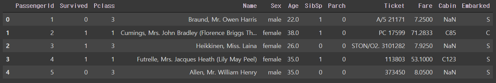

### 데이터 Feature 설명

- survival - 생존유무 => target 값 (0=사망, 1=생존)
- pclass - 티켓클래스
- sex - 성별
- age - 나이
- sibsp - 함께 탑승한 형제자매, 배우자 수 총합
- parch - 함꺼 탑승한 부모, 자녀 수 총합
- ticket - 티켓 넘버
- fare - 탑승 요금
- cabin - 객실 넘버
- bembarked - 탑승 항구

```python
# 결측치 확인 => train set과 test set에 비슷하게 age에 20% cabin에 80%의 결측지 발견
df_train.isnull().sum() / df_train.shape[0]
```


### Target Label 확인

target label이 어떤 distribution을 가지고 있는지 확인 필요
binary classification에서 분포가 어떠냐에 따라 모델의 평가방법이 달라지기 때문에

```python
f, ax = plt.subplots(1, 2, figsize=(18, 8))

# 파이그래프
df_train['Survived'].value_counts().plot.pie(explode=[0, 0.1], autopct='%1.1f%%', ax=ax[0], shadow=True)
ax[0].set_title('Pie plot - Survived')
ax[0].set_ylabel('')
# 항목별 개수를 카운트
sns.countplot('Survived', data=df_train, ax=ax[1])
ax[1].set_title('Count plot - Survived')

plt.show()
# target label의 분포가 제법 균일하므로 binary classification에 적합
```

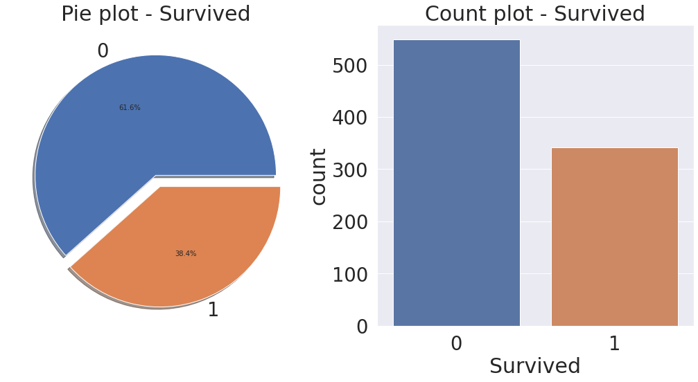

### 파이그래프 속성

>plt.pie(slice, labels=activities, startangle=90, shadow=True, explode=(0, 0, 0.1, 0), autopct='%1.1f%%')

- slice: 파이 조각의 데이터

- labels: 파이 조각의 라벨

- startangle: 그려지는 파이 조각 시작 위치

- shadow: 파이 차트의 그림자 효과 유무

- explode: 파이 조각이 돌출되는 크기

- autopct: 파이 조각의 전체 대비 백분율

  ---

## 2. 탐색적 데이터 분석(Exploratory Data Analysys)

Feature별로 데이터 분석 Insight 도출해보자

### 1. Pclass

- Pclass는 서수형 데이터입니다.
- Pclass,Survived 를 가져온 후, pclass 로 묶으면 각 pclass 마다 0, 1 이 count가 되는데, 이를 평균내면 각 pclass 별 생존률이 추출

```python
# 생존률
df_train[['Pclass', 'Survived']].groupby(['Pclass'], as_index=True).mean()
```


```python
# 막대그래프 시각화
df_train[['Pclass', 'Survived']].groupby(['Pclass'], as_index=True).mean().plot.bar()
# 생존률에 Pclass가 큰 영향을 미친다고 생각할 수 있다.
# 따라서 모델 생성시 해당 feature 사용이 좋을 것이라 판단
```

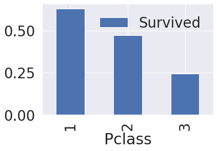

### 2. Sex

```python
f, ax = plt.subplots(1, 2, figsize=(18, 8))
df_train[['Sex', 'Survived']].groupby(['Sex'], as_index=True).mean().plot.bar(ax=ax[0])
ax[0].set_title('Survived vs Sex')
sns.countplot('Sex', hue='Survived', data=df_train, ax=ax[1])
ax[1].set_title('Sex: Survived vs Dead')
plt.show()
# 남성보다 여성의 생존확률이 높습니다.
# Pclass와 마찬가지로, Sex도 예측 모델에 쓰일 중요 featured임을 알 수 있다.
```

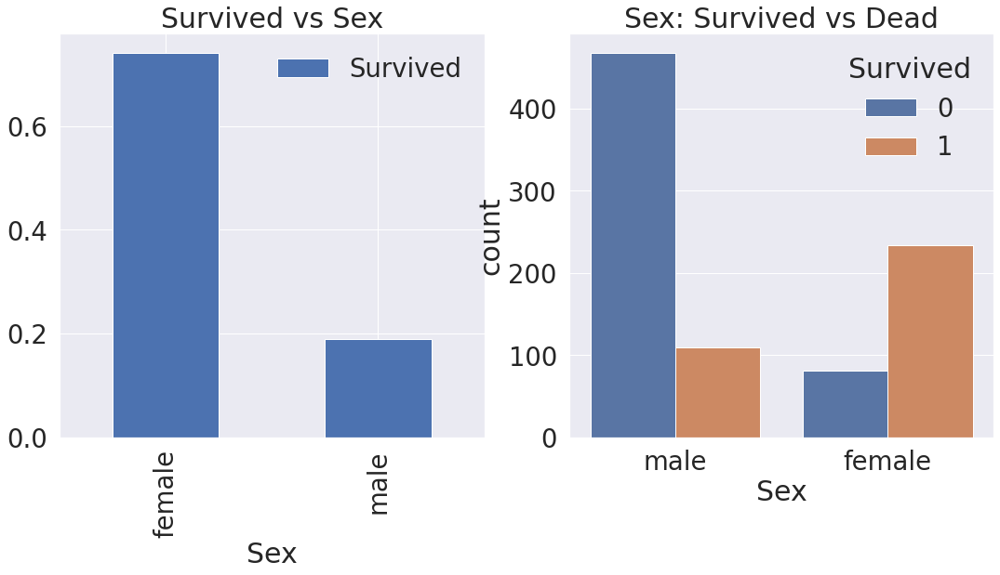

### 3. Both Sex and Pclass

```python
# factor형의 변수의 시각화를 할 때 유용한 시각화
sns.factorplot('Pclass', 'Survived', hue='Sex', data=df_train, size=6, aspect=1.5)
# 모든 클래스에서 여성의 생존률이 남성보다 높다.
```

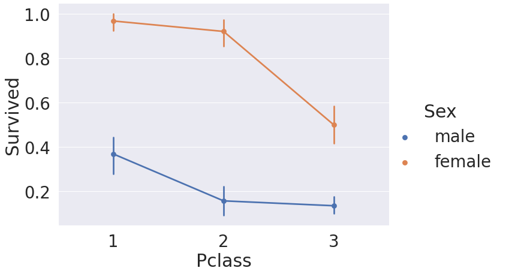

### 4. Age

```python
# 막대그래프는 어떤 분포로 퍼져있는지 확인할 수 없다. 그래서 분포를 확인할 때는 히스토그램을 사용
# but, 히스토그램은 구간을 어떻게 설정하냐에 따라 결과물이 크게 달라진다.
# 그 대안으로 분포를 곡선화 시켜주는 커널밀도추정(KDE)을 많이 사용
fig, ax = plt.subplots(1, 1, figsize=(9, 5))
sns.kdeplot(df_train[df_train['Survived'] == 1]['Age'], ax=ax)
sns.kdeplot(df_train[df_train['Survived'] == 0]['Age'], ax=ax)
plt.legend(['Survived == 1', 'Survived == 0'])
plt.show()
# 생존 KDE와 사망 KDE를 비교했을때 어린나이 구간에서 생존률이 상대적으로 높음을 알 수 있다.
```

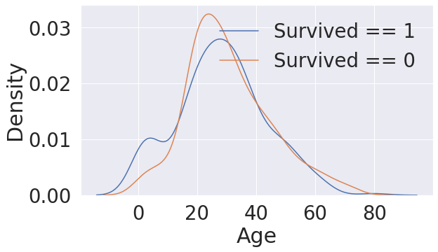

```python
cummulate_survival_ratio = []
for i in range(1, 80):
    cummulate_survival_ratio.append(df_train[df_train['Age'] < i]['Survived'].sum() / len(df_train[df_train['Age'] < i]['Survived']))
    
plt.figure(figsize=(7, 7))
plt.plot(cummulate_survival_ratio)
plt.title('Survival rate change depending on range of Age', y=1.02)
plt.ylabel('Survival rate')
plt.xlabel('Range of Age(0~x)')
plt.show()
# 나이가 어릴수록 생존률이 확실히 증가하는 것을 확인 가능
# Age도 중요 feature임을 확인할 수 있다.
```

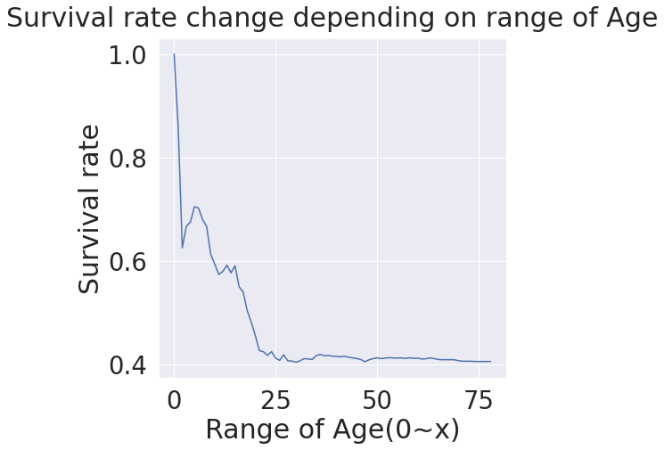

### 5. Embarked

```python
f, ax = plt.subplots(1, 1, figsize=(7, 7))
df_train[['Embarked', 'Survived']].groupby(['Embarked'], as_index=True).mean().sort_values(by='Survived', ascending=False).plot.bar(ax=ax)
# 탑승항구 별 생존률의 차이가 크진 않다.
```

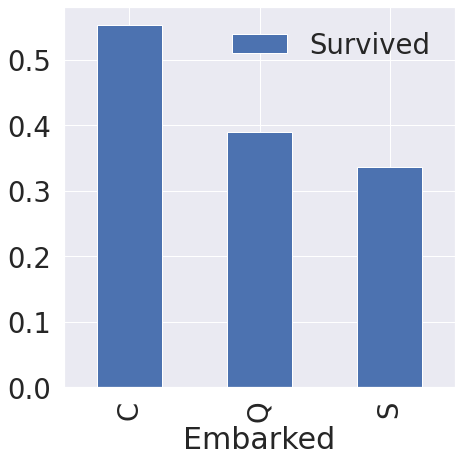

```python
# 다른 feature와의 상관관계
f,ax=plt.subplots(2, 2, figsize=(20,15))
sns.countplot('Embarked', data=df_train, ax=ax[0,0])
ax[0,0].set_title('(1) No. Of Passengers Boarded')
sns.countplot('Embarked', hue='Sex', data=df_train, ax=ax[0,1])
ax[0,1].set_title('(2) Male-Female Split for Embarked')
sns.countplot('Embarked', hue='Survived', data=df_train, ax=ax[1,0])
ax[1,0].set_title('(3) Embarked vs Survived')
sns.countplot('Embarked', hue='Pclass', data=df_train, ax=ax[1,1])
ax[1,1].set_title('(4) Embarked vs Pclass')
plt.subplots_adjust(wspace=0.2, hspace=0.5)
plt.show()
```

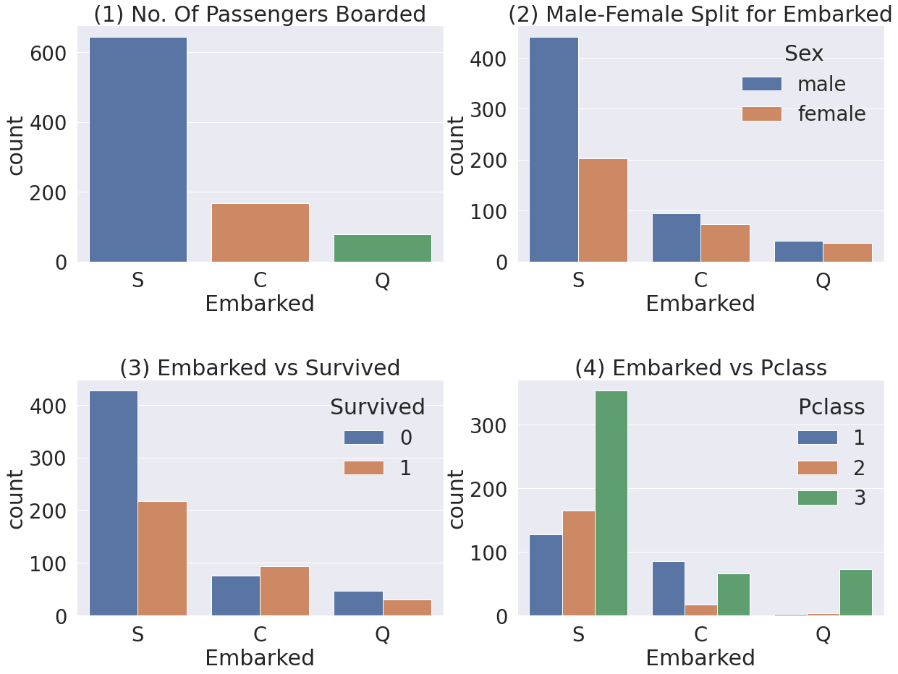

* Figure(1) - 전체적으로 봤을 때, S 에서 가장 많은 사람이 탑승했습니다.
* Figure(2) - C와 Q 는 남녀의 비율이 비슷하고, S는 남자가 더 많습니다.
* Figure(3) - 생존확률이 S 경우 많이 낮은 걸 볼 수 있습니다. (이전 그래프에서 봤었습니다)
* Figure(4) - Class 로 split 해서 보니, C가 생존확률이 높은건 클래스가 높은 사람이 많이 타서 그렇습니다. S는 3rd class 가 많아서 생존확률이 낮게 나옵니다.

### 6. Family(Sibsp + Parch)

```python
# Sibsp와 Parch를 합치면 함께 탑승한 가족의 수가 되므로 새로운 Feature 생성
df_train['FamilySize'] = df_train['SibSp'] + df_train['Parch'] + 1 # 자신을 포함해야하니 1을 더합니다
df_test['FamilySize'] = df_test['SibSp'] + df_test['Parch'] + 1 # 자신을 포함해야하니 1을 더합니다
```

```python
f,ax=plt.subplots(1, 3, figsize=(40,10))
sns.countplot('FamilySize', data=df_train, ax=ax[0])
ax[0].set_title('(1) No. Of Passengers Boarded', y=1.02)

sns.countplot('FamilySize', hue='Survived', data=df_train, ax=ax[1])
ax[1].set_title('(2) Survived countplot depending on FamilySize',  y=1.02)

df_train[['FamilySize', 'Survived']].groupby(['FamilySize'], as_index=True).mean().sort_values(by='Survived', ascending=False).plot.bar(ax=ax[2])
ax[2].set_title('(3) Survived rate depending on FamilySize',  y=1.02)

plt.subplots_adjust(wspace=0.2, hspace=0.5)
plt.show()
```

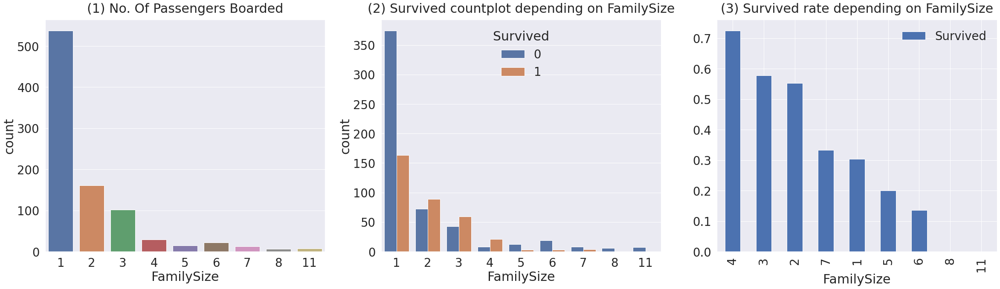

* Figure (1) - 가족크기가 1~11까지 있음을 볼 수 있습니다. 대부분 1명이고 그 다음으로 2, 3, 4명입니다.
* Figure (2), (3) - 가족 크기에 따른 생존비교입니다. 가족이 4명인 경우가 가장 생존확률이 높습니다,
가족수가 많아질수록, (5, 6, 7, 8, 11) 생존확률이 낮아지네요.
가족수가 너무 작아도(1), 너무 커도(5, 6, 8, 11) 생존 확률이 작네요. 3~4명 선에서 생존확률이 높은 걸 확인할 수 있습니다.

### 7. Fare

```python
# 탑승요금은 연속적인 데이터이므로 히스토그램 시각화
fig, ax = plt.subplots(1, 1, figsize=(8, 8))
g = sns.distplot(df_train['Fare'], color='b', label='Skewness : {:.2f}'.format(df_train['Fare'].skew()), ax=ax)
g = g.legend(loc='best')
```

```python
# 특이하기도 train set 말고 test set에 Fare 피쳐에 널 값이 하나 존재하는 것을 확인할 수 있었습니다.
# 그래서 평균 값으로 해당 널값을 넣어줍니다.
df_test.loc[df_test.Fare.isnull(), 'Fare'] = df_test['Fare'].mean() # testset 에 있는 nan value 를 평균값으로 치환합니다.
# log를 취해 보기 편하게 변환
df_train['Fare'] = df_train['Fare'].map(lambda i: np.log(i) if i > 0 else 0)
df_test['Fare'] = df_test['Fare'].map(lambda i: np.log(i) if i > 0 else 0)

fig, ax = plt.subplots(1, 1, figsize=(8, 8))
g = sns.distplot(df_train['Fare'], color='b', label='Skewness : {:.2f}'.format(df_train['Fare'].skew()), ax=ax)
g = g.legend(loc='best')
```

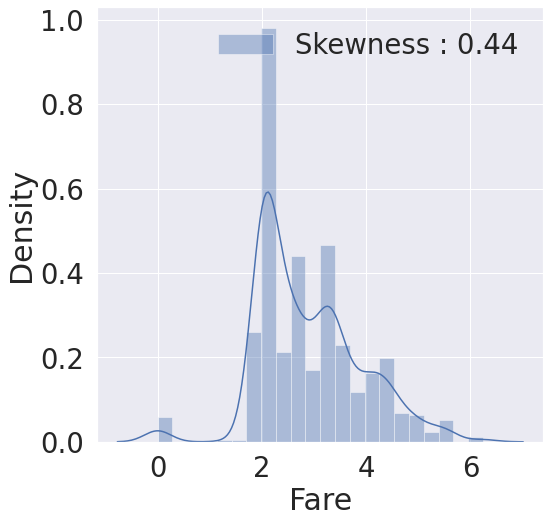

### 8. Cabin

NaN이 대략 80% 이므로, 생존에 영향을 미칠 중요한 정보를 얻어내기가 쉽지는 않습니다.

### 9. Ticket

NaN은 없지만 이 데이터로 유효한 결과를 뽑아내기위해선 아이디어가 필요

---

## 3. 특성공학(Feature Engineering)

### Fill Null

null data를 어떻게 채우느냐에 따라 모델의 성능이 좌지우지되므로 중요, train 뿐만 아니라 test도 똑같이 적용

#### 1. Age

```python
df_train['Initial']= df_train.Name.str.extract('([A-Za-z]+)\.') #lets extract the Salutations
df_test['Initial']= df_test.Name.str.extract('([A-Za-z]+)\.') #lets extract the Salutations
```

```python
# Initial과 Sex간의 count
pd.crosstab(df_train['Initial'], df_train['Sex']).T.style.background_gradient(cmap='summer_r') #Checking the Initials with the Sex
```

```python
df_train['Initial'].replace(['Mlle','Mme','Ms','Dr','Major','Lady','Countess','Jonkheer','Col','Rev','Capt','Sir','Don', 'Dona'],
                        ['Miss','Miss','Miss','Mr','Mr','Mrs','Mrs','Other','Other','Other','Mr','Mr','Mr', 'Mr'],inplace=True)

df_test['Initial'].replace(['Mlle','Mme','Ms','Dr','Major','Lady','Countess','Jonkheer','Col','Rev','Capt','Sir','Don', 'Dona'],
                        ['Miss','Miss','Miss','Mr','Mr','Mrs','Mrs','Other','Other','Other','Mr','Mr','Mr', 'Mr'],inplace=True)
```

```python
# train 에서 얻은 statistics 를 기반으로 null data 채우기
df_train.groupby('Initial').mean()
```

```python
# 각 initial 그룹별 Age 평균 값을 사용해서 채우기
df_train.loc[(df_train.Age.isnull())&(df_train.Initial=='Mr'),'Age'] = 33
df_train.loc[(df_train.Age.isnull())&(df_train.Initial=='Mrs'),'Age'] = 36
df_train.loc[(df_train.Age.isnull())&(df_train.Initial=='Master'),'Age'] = 5
df_train.loc[(df_train.Age.isnull())&(df_train.Initial=='Miss'),'Age'] = 22
df_train.loc[(df_train.Age.isnull())&(df_train.Initial=='Other'),'Age'] = 46

df_test.loc[(df_test.Age.isnull())&(df_test.Initial=='Mr'),'Age'] = 33
df_test.loc[(df_test.Age.isnull())&(df_test.Initial=='Mrs'),'Age'] = 36
df_test.loc[(df_test.Age.isnull())&(df_test.Initial=='Master'),'Age'] = 5
df_test.loc[(df_test.Age.isnull())&(df_test.Initial=='Miss'),'Age'] = 22
df_test.loc[(df_test.Age.isnull())&(df_test.Initial=='Other'),'Age'] = 46
```

#### 2. Embarked

```python
# S에서 가장 많이 탔으므로 S로 채우기
df_train['Embarked'].fillna('S', inplace=True)
df_train.isnull().sum()[df_train.isnull().sum() > 0]
```

### Change Age

Age는 continuous feature이지만 그룹화하여 카테코리화 시켜줄 수 있다.
continous를 categorical로 바꾸면 impormation loss가 생길 수 있으므로 주의

```python
def category_age(x):
    if x < 10:
        return 0
    elif x < 20:
        return 1
    elif x < 30:
        return 2
    elif x < 40:
        return 3
    elif x < 50:
        return 4
    elif x < 60:
        return 5
    elif x < 70:
        return 6
    else:
        return 7    
    
df_train['Age_cat'] = df_train['Age'].apply(category_age)
df_test['Age_cat'] = df_test['Age'].apply(category_age)
```


### Change Initial, Embarked and Sex

컴퓨터가 인식할 수 있도록 수치화

```python
df_train['Initial'] = df_train['Initial'].map({'Master': 0, 'Miss': 1, 'Mr': 2, 'Mrs': 3, 'Other': 4})
df_test['Initial'] = df_test['Initial'].map({'Master': 0, 'Miss': 1, 'Mr': 2, 'Mrs': 3, 'Other': 4})

df_train['Embarked'] = df_train['Embarked'].map({'C': 0, 'Q': 1, 'S': 2})
df_test['Embarked'] = df_test['Embarked'].map({'C': 0, 'Q': 1, 'S': 2})

df_train['Sex'] = df_train['Sex'].map({'female': 0, 'male': 1})
df_test['Sex'] = df_test['Sex'].map({'female': 0, 'male': 1})
```

```python
# 각 feature별 상관관계 시각화
heatmap_data = df_train[['Survived', 'Pclass', 'Sex', 'Fare', 'Embarked', 'FamilySize', 'Initial', 'Age_cat', 'Age']] 

colormap = plt.cm.RdBu
plt.figure(figsize=(14, 12))
plt.title('Pearson Correlation of Features', y=1.05, size=15)
sns.heatmap(heatmap_data.astype(float).corr(), linewidths=0.1, vmax=1.0,
           square=True, cmap=colormap, linecolor='white', annot=True, annot_kws={"size": 16})

del heatmap_data
```

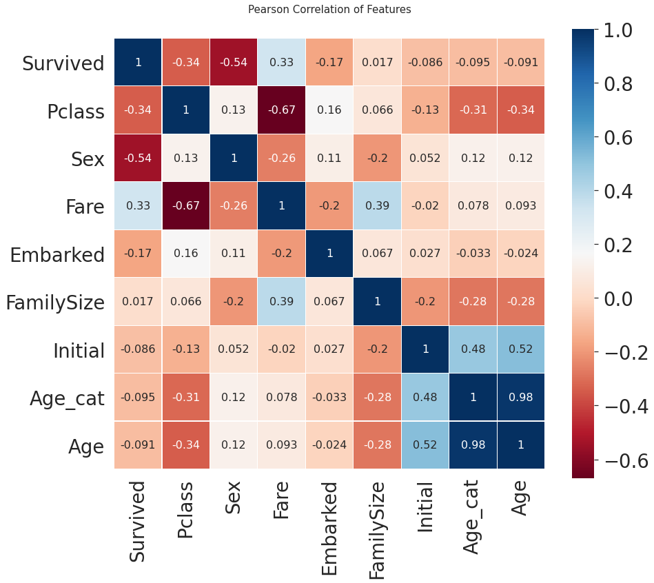

* Sex 와 Pclass 가 Survived 에 상관관계가 어느 정도 있음을 볼 수 있습니다.
* 생각보다 fare 와 Embarked 도 상관관계가 있음을 볼 수 있습니다.
* 강한 상관관계를 가지는 feature들이 없다.
따라서 모델을 학습시킬 때, 불필요한 feature 가 없다.

### 데이터전처리(Data Preprocessing)

모델의 성능을 높이기 위해 데이터 전처리 과정

#### One-hot encoding on Initiall and Embarked
One-hot encoding을 통해 각 클래스간 연관성을 동이하게 생성<br>
category가 많을 경우 column이 너무 많이 생성되어 `차원의 저주` 발생 주의

```python
df_train = pd.get_dummies(df_train, columns=['Initial'], prefix='Initial')
df_test = pd.get_dummies(df_test, columns=['Initial'], prefix='Initial')
```


```python
df_train = pd.get_dummies(df_train, columns=['Embarked'], prefix='Embarked')
df_test = pd.get_dummies(df_test, columns=['Embarked'], prefix='Embarked')
```

#### Drop Columns

필요없는 피쳐 제거

```python
df_train.drop(['PassengerId', 'Name', 'SibSp', 'Parch', 'Ticket', 'Cabin'], axis=1, inplace=True)
df_test.drop(['PassengerId', 'Name',  'SibSp', 'Parch', 'Ticket', 'Cabin'], axis=1, inplace=True)
```

## 4. 모델 개발 및 학습

Sklearn은 머신러닝에 관련된 모든 작업들이 손쉬운 인터페이스로 구현되어 있다.
현재 우리는 train set의 survived를 제외한 input을 가지고 모델을 최적화 시켜 탑승객의 생존유무를 판단하는 모델을 생성
그 후 test set을 input으로 주어서 탑승객의 생존유무를 예측

```python
#importing all the required ML packages
from sklearn.ensemble import RandomForestClassifier # 유명한 randomforestclassfier 입니다. 
from sklearn import metrics # 모델의 평가를 위해서 씁니다
from sklearn.model_selection import train_test_split # traning set을 쉽게 나눠주는 함수입니다.

### Preparation - Split dataset into train, valid, test set

​```python
X_train = df_train.drop('Survived', axis=1).values
target_label = df_train['Survived'].values
X_test = df_test.values
```

```python
X_tr, X_vld, y_tr, y_vld = train_test_split(X_train, target_label, test_size=0.2, random_state=2018)
```

### Model generation and prediction

#### Random Forest

여러 알고리즘 중 랜덤포레스트를 사용
랜덤포레스트는 결정트리기반 모델로 여러 결정 트리들을 앙상블한 모델

```python
model = RandomForestClassifier() # 생성
model.fit(X_tr, y_tr) # 학습
prediction = model.predict(X_vld) # 예측
```

```python
print('총 {}명 중 {:.2f}% 정확도로 생존을 맞춤'.format(y_vld.shape[0], 100 * metrics.accuracy_score(prediction, y_vld)))
# 총 179명 중 81.56% 정확도로 생존을 맞춤
```

```python
# 학습된 모델은 feature importance를 가지게 되는데,
# 이는 어떤 feature가 결과에 영향을 많이 미쳤는지 확인할 수 있다.
from pandas import Series

feature_importance = model.feature_importances_
Series_feat_imp = Series(feature_importance, index=df_test.columns)
```

```python
plt.figure(figsize=(8, 8))
Series_feat_imp.sort_values(ascending=True).plot.barh()
plt.xlabel('Feature importance')
plt.ylabel('Feature')
plt.show()
```

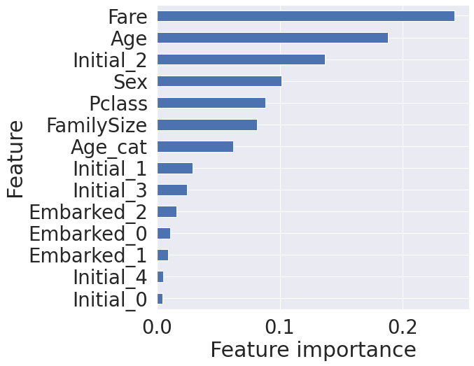

#### NN모델(Neural Network model) - 딥러닝 모델

```python
from keras.models import Sequential
from keras.layers.core import Dense, Dropout
from keras.optimizers import Adam, SGD

nn_model = Sequential()
nn_model.add(Dense(32,activation='relu',input_shape=(14,)))
nn_model.add(Dropout(0.2))
nn_model.add(Dense(64,activation='relu'))
nn_model.add(Dropout(0.2))
nn_model.add(Dense(32,activation='relu'))
nn_model.add(Dropout(0.2))
nn_model.add(Dense(1,activation='sigmoid'))

Loss = 'binary_crossentropy'
nn_model.compile(loss=Loss,optimizer=Adam(),metrics=['accuracy'])
```

```python
history = nn_model.fit(X_tr,y_tr, batch_size=64, epochs=500, validation_data=(X_vld, y_vld), verbose=1)
```

```python
hists = [history]
hist_df = pd.concat([pd.DataFrame(hist.history) for hist in hists], sort=True)
hist_df.index = np.arange(1, len(hist_df)+1)
fig, axs = plt.subplots(nrows=2, sharex=True, figsize=(16, 10))
axs[0].plot(hist_df.val_accuracy, lw=5, label='Validation Accuracy')
axs[0].plot(hist_df.accuracy, lw=5, label='Training Accuracy')
axs[0].set_ylabel('Accuracy')
axs[0].set_xlabel('Epoch')
axs[0].grid()
axs[0].legend(loc=0)
axs[1].plot(hist_df.val_loss, lw=5, label='Validation MLogLoss')
axs[1].plot(hist_df.loss, lw=5, label='Training MLogLoss')
axs[1].set_ylabel('MLogLoss')
axs[1].set_xlabel('Epoch')
axs[1].grid()
axs[1].legend(loc=0)
fig.savefig('hist.png', dpi=300)
plt.show();
```

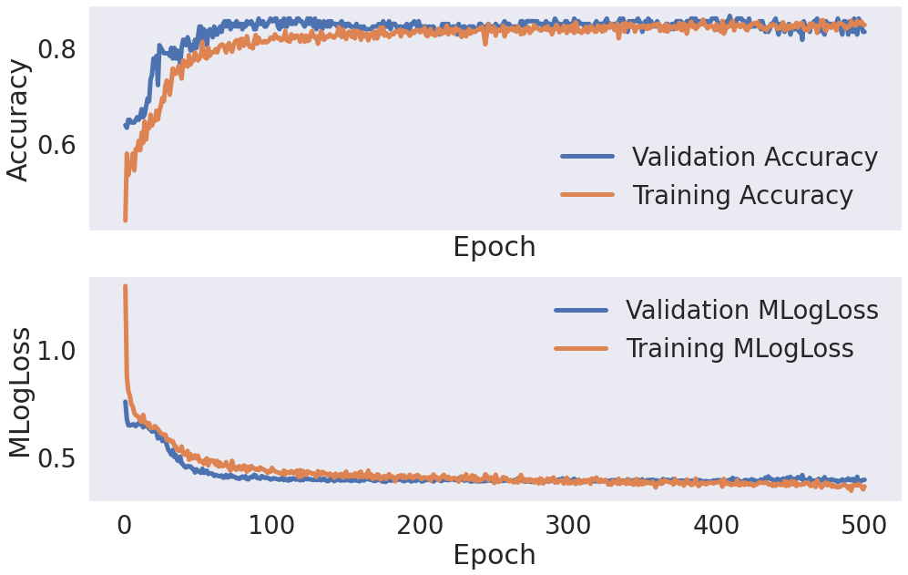

## 5. 모델 예측 및 평가

### 랜덤포레스트

```python
submission = pd.read_csv('sample_submission.csv')
prediction = model.predict(X_test)
submission['Survived'] = prediction
submission.to_csv('my_first_submission.csv', index=False)
# 정확도 스코어: 0.75598
```

### NN모델

```python
submission = pd.read_csv('sample_submission.csv')
prediction = nn_model.predict(X_test)
prediction = prediction > 0.5
prediction = prediction.astype(np.int)
prediction = prediction.T[0]
submission['Survived'] = prediction
submission.to_csv('my_nn_submission.csv', index=False)
# 정확도 사코어: 0.77990
```

---

`Google Colab`환경에서 진행하고 `markdown`으로 포스팅하는 거라 설명이 부족한 점은 양해바랍니다;;💦💦

예전에 잠깐 해보았던 데이터분석이지만 오랜만에 다시한번 해보니 감회가 새로웠고 진행하는 과정에서 느낀 궁금점들은 따로 정리하여 포스팅하도록 하겠습니당!!!

원본소스코드.ipynb 👉 https://github.com/ssabum/note/blob/master/data_analysis/titanic.ipynb

