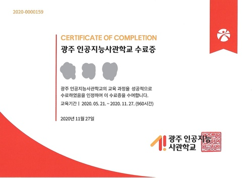

+++
author = "Hugo Authors"
title = "광주인공지능사관학교"
date = "2021-04-14"
description = "광주인공지능사관학교 2기 여러분~"
categories = [
    "Diary"
]
tags = [
    "광주인공지능사관학교", "AI", "1기", "2기", "광인사"

]

image = "광인사.png"

+++

# 광주인공지능사관학교👩‍🏫

`광주 인공지능사관학교`는 멋쟁이사자처럼의 IT교육 노하우와 광주광역시 & 광주정보문화산업진흥원의 인공지능 클러스터 사업을 바탕으로 인공지능 특화 교육을 제공하여 `AI 전문인재`로 성장할 수 있도록 돕는 교육 프로그램입니다.

작년에 개관하여 저는 광인사 1기를 수료하였고 현재 2기 모집을 마감한걸로 알고 있습니다. 2기 지원자들이나 광인사에 관심이 있으신 분들에게 도움을 드리기 위해 글을 남기게 되었습니다!!!😎

## 지원안내

* 지원자격

  연령 : 만 39세 이하

  지역 : 전국 지원 가능 (광주 권역 50% 이상 선발 예정)

* 교육일정

  온라인 Pre → 중고급 과정 → 해커톤 → 프로젝트 → 취업지원 및 멘토링 특강

보다 자세한 사항은 [광인사 안내 홈페이지](https://aischool.likelion.net/)에 들어가면 확인하실 수 있습니다.

또한 개인적으로 궁금한 사항은 qqq960909@likelion.org로 문의 주시면 알려줄 수 있는 범위 내에서 알려드리도록 하겠습니다!!

