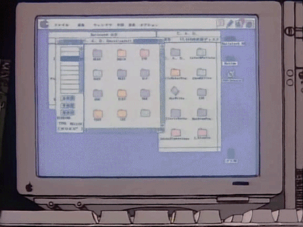

author = "Hugo Authors"
title = "외장ssd"
date = "2021-04-04"
description = "외장하드는 들어봤는데 외장SSD는 무엇이지?"
categories = [
    "Diary"
]
tags = [
    "삼성", "외장ssd", "t5",

]

image = "ssd.jpg"

+++

# 외장SSD?

> 외장하드, 즉 `외장 HDD`는 많이들 들어보았을 것이다. `외장 SSD`는 `HDD` 대신 `SSD`를 사용하여 만들어낸 외장 메모리 저장장치이다.  `SSD`는 `HDD`와 비교해 데이터 전송 속도가 빠르고, 전력 소모가 적으며, 플래터, 모터, 헤드 같은 부품이 없기 때문에 더 작고 얇게 제작할 수 있다.
>
> 따라서 `외장 SSD` 역시 단일 저장장치에서도 `HDD` 수준의 저장 용량을 확보할 수 있게 됐고, 입출력 인터페이스 역시 `SSD`의 빠른 속도를 선보이면서 휴대용 저장장치에 어울리는 방식으로 자리잡았다.
>
> `외장 SSD`의 가장 큰 장점은 전송 속도다. `HDD`는 바늘 처럼 생긴 헤드를 플래터 위에서 직접 움직이며 데이터를 찾거나 데이터를 기록하는 반면, 반도체로 제작한 `SSD`는 이러한 과정이 없는 만큼 더 빠르게 데이터를 읽고 쓸 수 있다. 

## 그래서 나도!

내 노트북의 용량은 `SSD 256GB`이다. 그러나 필수 소프트웨어가 깔리고 프로그램과 파일들 몇 개 깔다보니 금방 금방 줄어들었다...😥

그래서 고민끝에 구매하게된 `삼성 포터블 외장 SSD T5 500GB` ㅎㅎ 통장 잔고가 좋지 못해 `1TB`짜리는 사지 못했지만 나름 `FLEX`했다😎

그렇게 구매하고 배송받은 `외장 SSD`를 연결하는 순간...`C TO C TYPE` 연결시에 접촉 불량이 발생했다...

바로 삼성서비스센터에 무상교체를 보낸 상태이다...

빨리 정상작동 되는 새걸로 받아서 가득 채워버려야지...ㅎㅎ