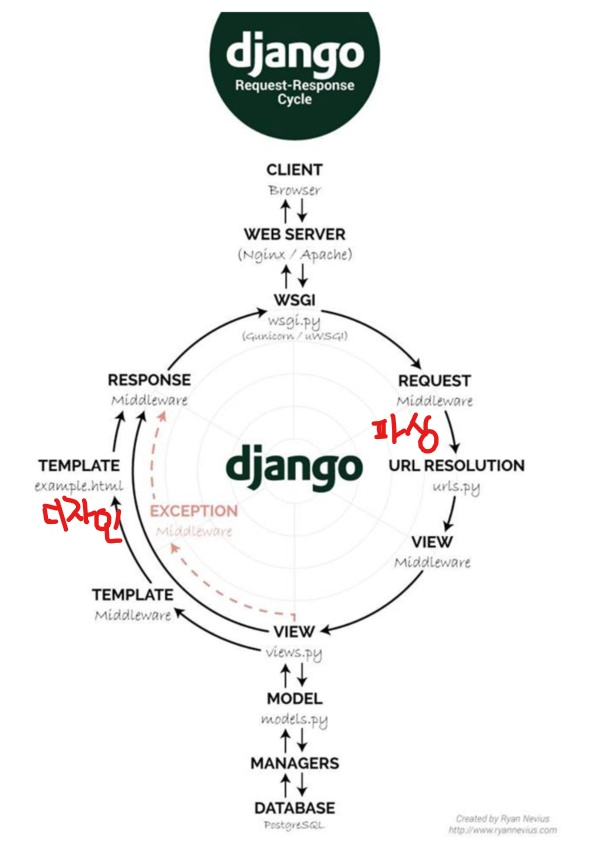

+++
author = "Hugo Authors"
title = "Django 기본"
date = "2021-03-26"
description = "장고를 다루기 위한 기초"
categories = [
    "TIL"
]
tags = [
    "python", "django",

]

image = "icon.png"

+++

# Django wep programming

>파이썬으로 만들어진 무료 오픈소스 웹 애플리케이션 프레임워크
>
>즉, 쉽고 빠르게 웹사이트를 개발할 수 있도록 돕는 구성요소로 이루어진 웹 프레임워크
>
>여기서 프레임워크란, 애플리케이션 개발에 바탕이 되는 템플릿과 같은 역할을 하는 클래스들과 인터페이스의 집합

## 기본 생성 파일

* mysite: 프로젝트를 담는 공간
* manage.py: 프로젝트와 다양한 방법으로 상호작용 하는 커맨드라인의 유틸리티
* init.py: 파이썬으로 하여금 이 디렉토리를 패키지처럼 다루라고 알려주는 용도의 빈 파일
* setting.py: 현재 프로젝트의 환경 및 구성을 저장
* urls.py: 현재 프로젝트의 URL선언을 저장
* wsgi.py: 현재 프로젝트를 서비스하기 위한 WSGI 호환 웹 서비의 진입점

## django cycle



## django 명령어

```python
# 프로젝트 생성
$ django-admin startproject 프로젝트명

# 앱 생성
$ python manage.py startapp 앱명

# 서버가 제대로 동작하는지 로컬에서 확인, http://127.0.0.1:8000/에서 출력
$ python manage.py runserver

# INSTALLED_APPS 설정을 탐색하여 데이터베이스 생성
$ py manage.py migrate

# 데이터베이스에 테이블을 생성할 수 있도록 설계도를 작성
$ py manage.py makemigrations polls

# 데이터베이스에 실제 테이블을 생성
$ py manage.py migrate

# API를 사용하기 위해
$ py manage.py shell

# 생성한 모델을 추가
$ from polls.models import Choice, Question

# 관리자 생성
# winpty: windows 콘솔과 통신이 가능한 인터페이스를 제공하는 windows software package
$ winpty python manage.py createsuperuser
```

## 프로젝트와 앱

* 앱: 특정한 기능을 수행하는 웹 어플리케이션, 다수의 프로젝트에 포함될 수 있다.
* 프로젝트: 특정 웹 사이트를 위한 앱들과 각 설정들을 한데 묶어놓은 것, 다수의 앱을 포함할 수 있다.

## 작동 순서

1. view 내용 입력
2. 뷰를 호출하기 위한 연결 url 생성을 위해 `urls.py` 파일 생성
3. 최상위 URLconf에서 생성한 `urls.py`모듈을 바라보게 설정
   * 이때 `include()`함수는 다른 URLconf드을 참조할 수 있도록 도움
   * 만약 `127.0.0.1/polls/`이라는 url을 받으면 파싱을 하여 분기, 해당 path인 `polls`을 잡아내고 연결을 시켜줌
   * 연결된 `urls.py`에서 path를 통해 `view`로 연결
   * `view`내부의 함수를 통해 `response`를 클라이언트에게 전달

## 데이터베이스

django는 기본적으로 SQLite를 사용하도록 구성되어 있으며, 다른 데이터베이스를 사용하고 싶다면 `setting.py`파일을 수정해서 사용할 수 있다.

## INSTALLED_APPS

django를 사용할 때 기본적으로 딸려 오는 앱으로 추가적으로 모델을 사용하기 위해 추가하면 된다.

* admin: 관리용 사이트
* auth: 인증시스템
* contenttypes: 컨텐츠 타입을 위한 프레임워크
* sessions: 세션 프레임워크
* messages: 메세징 프레임워크
* staticfiles: 정적 파일을 관리하는 프레임워크

## 모델

부가적인 메타데이터를 가진 데이터베이스의 구조(layout)를 지칭

> 모델은 데이터에 관한 단 하나의, 가장 확실한 진리의 원천
>
> 이 원칙에 따라 데이터 모델을 한곳에서 정의하고, 이것으로부터 자동으로 뭔가를 유도하는 것이 목표

## API

개발자가 필요로하는 데이터를 뽑아낼 수 있도록 하는 함수, 또는 서버에게 데이터베이스에게 데이터를 입력할 수 있도록 하는 함수

## Admin 페이지

사이트 관리를 위한 관리자 전용 페이지로 django는 자동으로 제공

## ssafy class

### 중요

`urls.py`: 주소 관리

`views.py`: 페이지 관리

`models.py`: 데이터베이스 관리

### 실행순서

1. installed_apps: 앱 등록
2. project/urls.py: path 등록
3. app/views.py: 요청 수신/반환 함수 작성
4. templates/index.html: templates 작성