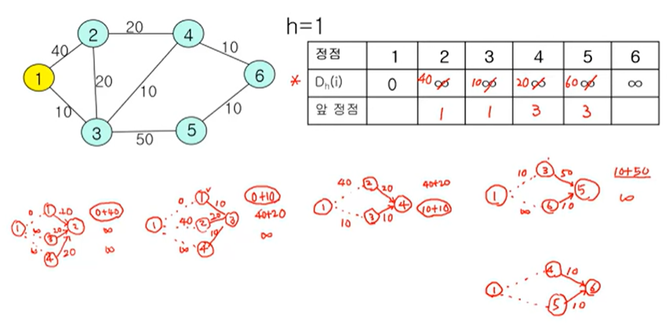
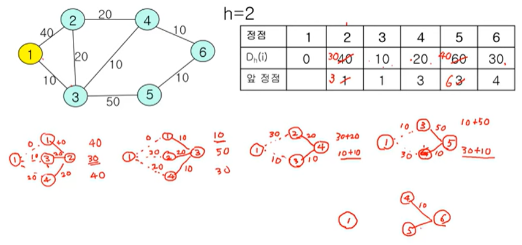
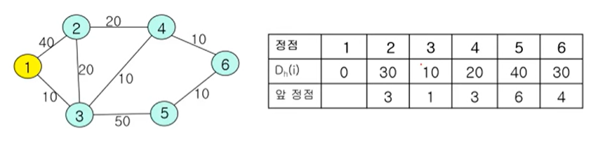

+++
author = "Hugo Authors"
title = "[CS]이산수학 3rd"
date = "2021-07-25"
description = "Computer Science 이산수학 세번째 이야기"
categories = [
    "TIL"
]
tags = [
    "CS", "이산수학",

]

image = "math.jpg"

+++

# 알고리즘

> 순서대로 정의된 절차
>
> 모든 동작은 명확하게 정의되어 실행 가능해야 한다.
>
> 일정한 시간 안에 반드시 원하는 결과가 나와야 한다.

## 1. 알고리즘 구조

* 순차적 구조
* 분기 구조
* 반복 구조
* 점프 구조

## 2. 알고리즘 기술 방법

* 플로우 차트
* 프로그램 언어 코드
* pseudocode

# 그래프

> 정점`vertex`과 간선`edge`들의 집합으로 이루어진 집합

## 1. 오일러 그래프

* 오일러 경로 : 그래프의 모든 연결선을 한번만 방문하는 경로
* 오릴러 순환 : 시작점과 끝점이 동일한 오일러 경로
* 오일러 그래프 : 오일러 순환이 존재하는 그래프
* 차수 : 정점에 접합된 연결선의 수

## 2. 오일러 경로를 갖기 위한 필요충분 조건

2개 이상의 정점을 갖는 루프가 없는 연결그래프에서 홀수 차수를 갖는 정점이 하나도 없거나 오직 두개만 존재해야 한다. 특히 모든 정점이 짝수 차수를 자기면 오일러 순환이 존재하고, 이 그래프는 오일러 그래프이다.

## 3. 해밀턴 경로

* 그래프에서 모든 정점을 정확히 한번만 지나는 경로
* 해밀턴 순환 : 시작점과 끝점이 같은 해밀턴 경로
* 시간복잡도 : O(x^n)

## 4. 그리드 알고리즘

결정을 할 때마다 최종 결과에 관계없이 그 순간에서 최선의 선택을 진행, 하지만 최종의 결과가 최적이라는 보장은 없다.

# 신장트리

> 순환이 존재하지 않는 부분 그래프

## 1. 최소 신장트리 알고리즘

### Prim 알고리즘 

* 가중그래프에서 가중치의 합을 최소로 하는 신장트리

* 그리디 알고리즘 방식을 사용하지만 그래프에서 항상 최적의 결과를 보장

* 간선의 개숭에 비해 정점의 개수가 적은 경우 유리

* 시간복잡도 : O(V^2) / O(ElogV)

### Kruskal 알고리즘

* 가장 고려할 점은 계산할 때 순환을 만들지 않는 것
* 정점의 개수에 비해 간선의 개수가 적은 경우 유리
* 시간복잡도 : O(ElogV)

## 2. 최단 경로 알고리즘

### Dijkstra 알고리즘

* 하나의 정점에서 다른 모든 정점으로 가는 최단 경로를 탐색
* 방향, 비방향 그래프 모두 적용
* 가중치값이 음수가 아니어야 한다.
* 시간복잡도 : O(ElogV)

### Bellman-ford 알고리즘

* 하나의 정점에서 다른 모든 정점으로 가는 최단 경로를 탐색
* 방향, 비방향 그래프 모두 적용
* 가중치가 음수일 때도 적용, 하지만 순환을 구성하는 연결선의 가중치는 양수여야 한다.
* 라우팅 프로토콜에 사용
* 시간복잡도 : O(VE) / O(E^2)

