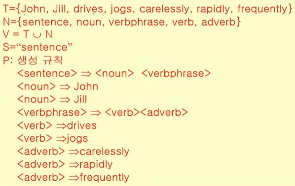
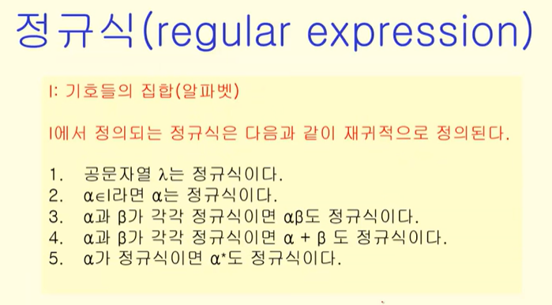

+++
author = "Hugo Authors"
title = "[CS]이산수학 4th"
date = "2021-07-25"
description = "Computer Science 이산수학 네번째 이야기"
categories = [
    "TIL"
]
tags = [
    "CS", "이산수학",

]

image = "math.jpg"

+++

# 언어

> 기본요소들의 집합으로 만들어지는 문자열

* 알파벳 : 기호들의 집합
* 문법 : 알파벳으로부터 문장들의 집합을 형성하는 규칙이 존재
* 의미론 : 규칙에 합당하게 만들어진 문장들이 어떤 의미를 갖는지 결정

## 1. 형식언어

구성요소 : 심벌, 알파벳, 문자열, 공문자열

## 2. 구-구문 문법

`G = (V, T, S, P)` 👉 `V : 기호의 집합` `T : 단말기호` `S : 시작기호` `P : 생성규칙`

## 3. 정규식

# 오토마타

## 1. 유한 상태기계

> 상태가 유한개 존재하는 기계

* 출력이 있는 유한 상태기계
  * 출력이 상태의 추이함수에 의해 결정
  * 출력이 상태에 의해 결정

* 출력이 없는 유한 상태기계

* 튜닝머신 등등

## 2. 결정 오토마타

입력값에 대해서 전이되는 상태가 정확하게 결정

## 3. 비결정 오토마타

입력값에 대해서 상태 전이가 다수 존재, 입력값에 대해서 상태 전이가 발생하지 않을 수 있다.

# 셈

> 어떤 사건이 발생할 수 있는 경우의 수

## 1. 곱의 법칙

사건들이 동시에 발생할 경우

## 2. 합의 법칙

사건들이 동시에 발생할 수 없는 경우

### 포함배제의 원리

합의 법칙을 적용할때 중복되어 계산된 경우의 수를 고려