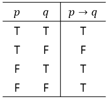
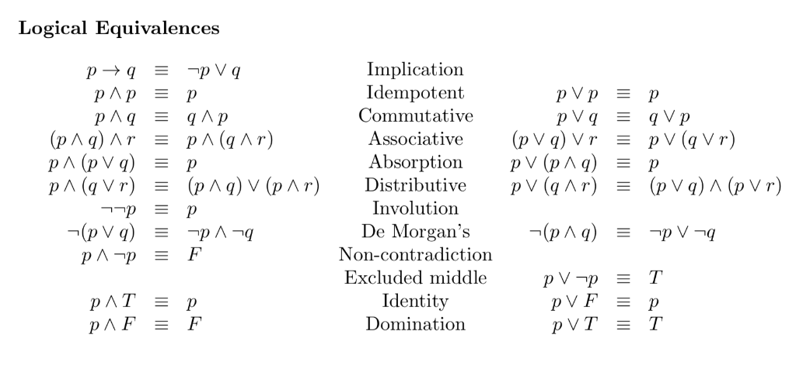

+++
author = "Hugo Authors"
title = "[CS]이산수학"
date = "2021-07-13"
description = "Computer Science 이산수학"
categories = [
    "TIL"
]
tags = [
    "CS", "이산수학",

]

image = "math.jpg"

+++

# 이산수학(Discrete mathematics)

>불연속적인 숫자를 다루는 수학
>
>컴퓨터를 위한 수학, 참과 거짓으로 판단할 수 있으며 자료구조 또는  알고리즘의 베이스, 논리적 사고, 컴퓨팅 사고력 향상

## 1. 명제

* 참이나 거짓으로 진리를 구분할 수 있는 문장
* 명제는 0또는 1만을 가지는 컴퓨터 메모리처럼 항상 참과 거짓 중 하나의 값만을 가짐
* 여러 개의 명제를 조합할 수 있음

## 2. 연산자

명제를 다루기 위한 도구

## 3. 명제의 역, 이, 대우

- 조건 명제에서 사용되는 `역, 이, 대우`는 하나의 명제를 변형하여 표현
- 증명하기 어려운 명제는 `대우`를 이용하여 증명할 수 있다
- `대우`가 `참`인 경우 본 명제 또한 `참`이라는 특성을 가지고 있다

## 4. 진리표

## 5. 동치관계

- 동치란 `논리적으로 일치한다`는 의미
- 흔히 동치는 같은 의미를 가진 더 쉬운 명제를 발견하는 데 사용
- 동치법칙에는 다양한 종류가 존재

