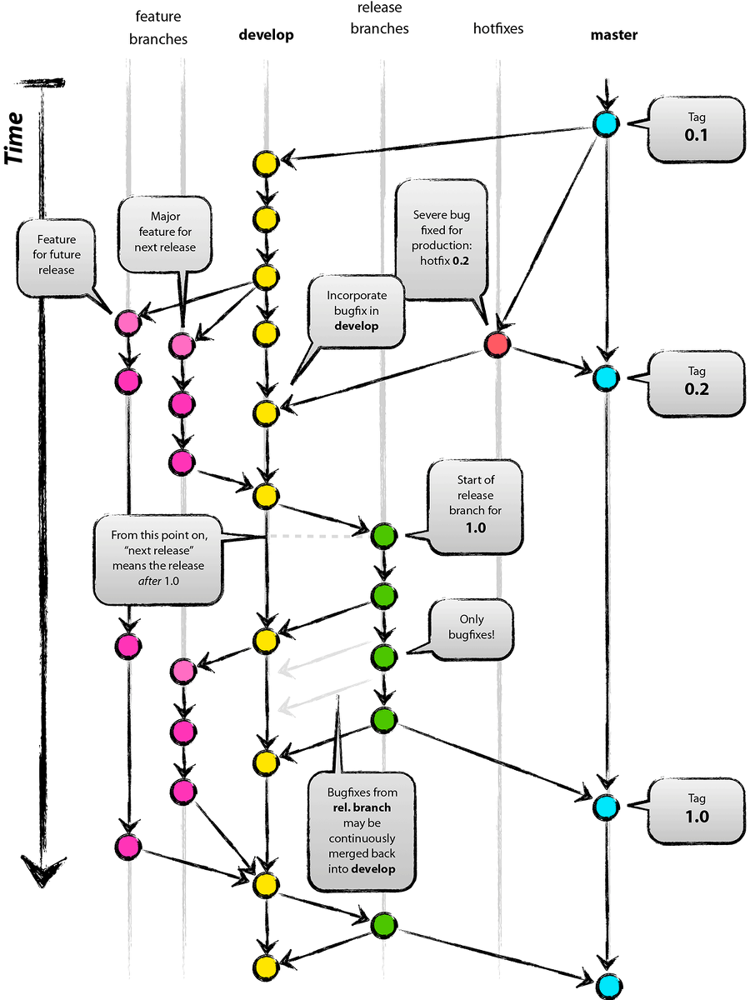

+++
author = "Hugo Authors"
title = "[Git]git-flow"
date = "2021-08-30"
description = "Git-flow: A successful git branching model"
categories = [
    "TIL"
]
tags = [
    "git", "git-flow",

]

image = "git.png"

+++

# 🛠 버전 관리 시스템

어느 정도 규모가 있는 소프트웨어를 개발하다보면 소스코드의 버전 관리 시스템(Version Control System)을 사용하게 된다. 비교적 오래된 프로젝트의 경우 SVN(Subversion)이나 CVS(Concurrent Versions System), 심지어 파일 서버에 소스코드를 보관하는 형태로 코드를 관리하는 경우도 있다. 하지만 최근에는 DVCS(Distributed Concurrent Versions System) 인 `git`으로 어느정도 통일되는 추세이다. `git`이 갖는 큰 장점중 하나는 효율적인 브랜치 관리다. 쉽게 브랜치를 생성하여 기능을 추가하거나 버그를 수정할 수 있고, 만들어진 브랜치를 손쉽게 병합 할 수 있다.

## 1. git-flow

> `git-flow`는 Vincent Driessen의 "A successful git branching model"에서 제안한 브랜치 모델을 쉽게 사용할 수 있도록 몇개의 명령으로 구현해 놓은 git의 확장이다.



Vincent Driessen의 브랜칭 모델에는 5개의 브랜치가 사용된다.

### 1) master

master 브랜치는 배포될 안정적인 버전의 소스코드를 포함하고 있다. master 브랜치의 HEAD는 최신 배포판의 소스 코드 버전이 있다. master 브랜치에는 지난 배포 버전이 태그(tag) 형태로 관리된다. master 브랜치에는 배포해도 될 만큼 안정성이 검증된 코드들이 병합된다.

### 2) develop

develop 브랜치에는 끊임 없이 새로운 기능들과 버그 수정들이 병합된다. 새로운 기능을 개발하는 여러 개발자들은 develop 브랜치를 기준으로 feature 브랜치를 생성해서 작업을 한다음 다시 develop 브랜치로 내용을 병합한다. 따라서 develop 브랜치에는 끊임없이 새로운 내용들이 병합된다. 

### 3) feature

새로운 기능 개발을 위해 생성하는 브랜치다. develop 브랜치를 기반으로 생성되며 기능 개발이 완료된 다음 다시 develop 브랜치로 병합된다. 

### 4) release

새로운 릴리즈를 생성하기 위해 만들어지는 브랜치다. develop 브랜치를 기반으로 생성되며 develop 브랜치와 master 브랜치로 병합된다. 새로운 릴리즈를 생성하기 위해 다음번 릴리즈에 포함될 기능셋들을 확정지어야 하며, 해당 기능들이 개발되어 develop 브랜치로 병합되면 그 이후 release 브랜치를 생성하여 릴리즈를 준비한다. 

릴리즈 브랜치에는 릴리즈 준비 과정에서 발견된 버그 수정 사항 같은 패치들만 적용이 되며, 메이저 기능들은 추가되지 않는다.

이 후 릴리즈 브랜치의 코드가 안정적이라고 판단되면 master 브랜치에 병합되고 릴리즈에 해당하는 태그가 생성된다. 또 한 릴리즈 브랜치에 수정된 버그들은 develop 브랜치로도 다시 병합된다. 

### 5) hotfix

정기적인 릴리즈 이외에 긴급하게 수행되어야 할 버그 수정을 반영하기 위해 생성되는 브랜치다. 정기적인 릴리즈 계획과 별도로 치명적인 버그가 발견되어 1분 1초라도 빨리 패치가 되어야 할 경우 이 브랜치를 사용한다. 

hotfix 브랜치는 master 브랜치를 기반으로 생성된다. 생성된 hotfix 브랜치에 긴급 패치들이 반영된다. 이 후 다시 master 브랜치로 병합되고 태그를 생성한다. 마찬가지로 수정 사항은 develop 브랜치로도 병합되어 긴급 수정 사항이 이후 릴리즈에도 반영되도록 한다.

## 2. git-flow 설치

> git-flow는 git의 확장이다. 즉 git-flow를 사용하기 위해서 우선 git이 설치되어 있어야 한다. git은 패키지 매니저를 이용해 쉽게 설치할 수 있다. 

우선 우분투 같은 데비안 계열의 리눅스는 `apt-get`을 이용해서 설치할 수 있다.

```powershell
$ apt-get install git-core
$ apt-get install git-flow
```

맥의 경우 `HomeBrew`를 이용해 쉽게 설치가 가능하다.

```powershell
$ brew install git
$ echo "export PATH=/usr/local/bin:$PATH" >> ~/.bash_profile
$ brew install git-flow-avh
```

윈도우의 경우 `Cygwin`을 이용해 쉽게 설치가 가능하다.

```powershell
$ wget -q -O - --no-check-certificate https://github.com/nvie/gitflow/raw/develop/contrib/gitflow-installer.sh | bash
```

## 3. git-flow 사용법
### 1) init

> git-flow를 사용하기 위해서는 초기화가 필요하다. 마치 git init을 실행해서 로컬 저장소(Repository)를 초기화하는 것처럼 git flow init을 통해서 브랜치들을 생성해줘야한다. 

브랜치 관리를 할 로컬 저장소 디렉토리에서 다음 명령을 실행한다.

```powershell
$ git flow init
```

그러면 Vincent Driessen이 제안했던 여러 브랜치들의 이름을 지정할 수 있다. 그냥 엔터키만 누르면 기본값으로 이름이 정해진다.

```powershell
How to name your supporting branch prefixes?
Feature branches? [feature/]
Bugfix branches? [bugfix/]
Release branches? [release/]
Hotfix branches? [hotfix/]
Support branches? [support/]
Version tag prefix? []
Hooks and filters directory? [/Users/user/workspace/test/.git/hooks]
```

위 명령을 실행하면 기본값으로 브랜치들이 생성된다.

* **master** : 사용자에게 배포되는 Stable 브랜치

* **develop** : 다음 릴리즈를 위해 기능들을 모으는 최신 브랜치

* **feature** : 특정 기능 개발을 위한 브랜치

- **release** : 릴리즈를 위해 버그 픽스(Bug fix)를 모으는 브랜치

* **hotfix** : 긴급 버그 픽스를 위한 브랜치

* **support** : 버전 호환성 문제를 위한 브랜치

Version tag prefix는 master 브랜치로 릴리즈 버전이 병합될 때 생성되는 태그(Tag)의 프리픽스(Prefix)를 설정할 수 있는 선택 항목이다. 

Hooks and filters directory 는 git hook을 위한 디렉토리다. git 역시 다른 버전 관리 시스템처럼 어떤 이벤트가생겼을 때 자동으로 특정 스크립트를 실행하도록 할 수 있다. 예를 들어 git commit을 수행했을 때 자동으로 git push를 하도록 post-commit 파일에 훅을 저장해 놓을 수 있다. 다양한 활용 방안이 있으므로 잘 사용하면 된다. 

### 2) feature

특정 기능을 개발하기 위한 개발 브랜치(feature branch)를 다루기 위한 명령이다. 새로운 개발 브랜치를 생성하기 위해서는 다음 명령을 실행한다. 

```powershell
$ git flow feature start <feature name>
```

이 명령을 수행하면 develop 브랜치를 기반으로 새로운 기능 개발 브랜치가 생성되며 자동으로 해당 브랜치로 checkout 된다. 생성된 브랜치는 feature/<feature name>의 이름을 갖는다. (혹은 git flow init에서 feature 브랜치 이름으로 입력한 문자열이 feature 대신 들어간다)

이제 새로 생성된 기능 개발 브랜치에 기능 개발 작업을 하고, 커밋을 하면서 작업을 진행하면된다. 

기능 개발 작업이 끝나서 마무리를 할 때에는 다음 명령을 실행한다.

```powershell
$ git flow feature finish <feature name>
```

이 명령을 수행하면, git-flow는 develop 브랜치로 checkout 한 다음, feature branch의 변경사항을 merge 한다. 그리고 feature branch를 삭제한다. 

만약 github 같은 플랫폼을 통해서 여러 개발자들과 함께 작업을 하려는 경우 원격 저장소(remote repository)에 기능개발 브랜치를 push 해야한다. 다음 명령을 수행하면 된다. 

```powershell
$ git flow feature publish <feature name>
```

반대로 원격 저장소에서 feature branch를 가져오려면 다음 명령을 수행하면 된다. 

```powershell
$ git flow feature pull origin <feature name>
```

### 3) release

릴리즈를 위한 브랜치를 생성하기 위해서 다음 명령을 실행하면 된다. 

```powershell
$ git flow release start <version>
```

이 명령을 실행하면 develop 브랜치를 기반으로 release/version 이라는 브랜치가 생성된다. 마찬가지로 git flow init 수행시 release 브랜치 이름으로 다른 문자열을 입력했으면 그 문자열이 release 대신 설정된다. 

이제 이 브랜치에 버그 수정 사항들을 추가하면 된다. 

feature와 마찬가지로 다른 사용자와 협업을 위해 원격 저장소로 push 할 수 있다. 

```powershell
$ git flow release publish <version>
```

이 명령을 수행하면 origin으로 설정된 원격 저장소로 변경사항을 Push 한다.

반대로 원격 저장소에서 변경사항을 가져오려면 다음 명령을 수행하면 된다. 

```powershell
$ git flow release track <version>
```

릴리즈 준비 작업이 마무리되었으면 다음 명령을 이용해서 릴리즈를 마무리한다. 

```powershell
$ git flow release finish <version>
```

>이 명령을 수행하면
>
>1) release 브랜치를 master 브랜치에 병합(merge) 하고
>
>2) release 버전을 태그로 생성한다. 이 때, git flow init 에서 명시한 Version tag prefix 문자열이 release버전 앞에 추가되어 태그로 생성된다. 
>
>3) release 브랜치를 develop 브랜치에 병합한다.
>
>4) release 브랜치를 삭제한다. 
>
>이제 새로운 릴리즈가 포함된 master 브랜치를 원격 저장소에 태그들과 함께 push하면 된다.

```powershell
$ git push --tags
```

### 4) hot fix

긴급 패치를 위한 Hot Fix 브랜치 생성도 릴리즈 브랜치와 비슷하게 사용할 수 있다. 

```powershell
$ git flow hotfix start <version>
```

위 명령을 수행하면 새로운 핫픽스 브랜치가 생성된다.

이제 긴급하게 패치할 버그 수정사항들을 이 브랜치에 반영한 다음 finish 명령으로 핫 픽스를 마무리한다. 

```powershell
$ git flow hotfix finish <version>
```

> 이 명령을 수행하면
>
> 1) hotfix 브랜치를 master 브랜치로 병합한다
>
> 2) hotfix 버전을 태그로 생성한다. 마찬가지로 git flow init 에서 명시한 Version tag prefix 문자열이 hotfix 버전 앞에 추가되어 태그로 생성된다. 
>
> 3) hotfix 브랜치를 develop 브랜치에 병합한다
>
> 4) hotfix 브랜치를 삭제한다. 