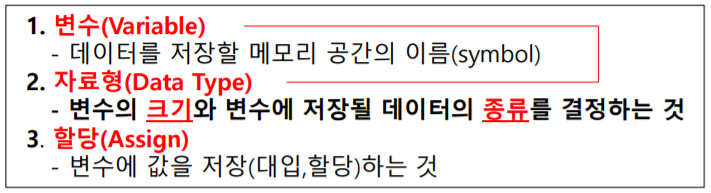
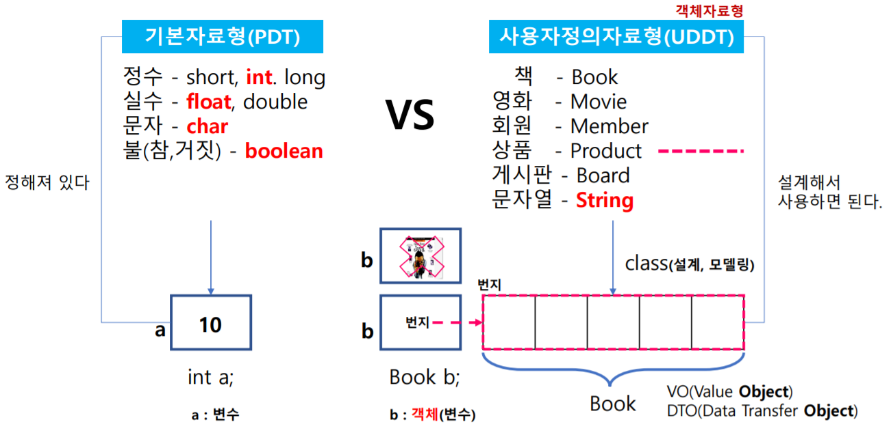
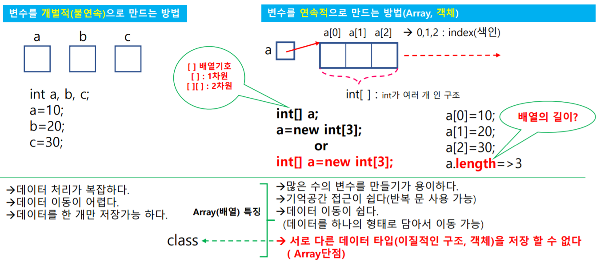

+++
author = "Hugo Authors"
title = "[JAVA]1일차"
date = "2021-07-13"
description = "자바개발환경, JAVA 구동방식, 프로그래밍 3대 요소, 변수와 배열"
categories = [
    "TIL"
]
tags = [
    "JAVA", "프로그래밍",

]

image = "java.jpg"

+++

# 1. 자바개발환경 설치

`JDK`는 `java development kit`의 줄임말로 개발하는데 필요한 라이브러리와 플랫폼이 포함


* `byte code`는 `exe파일`이 아니기 때문에 바로 실행이 불가능하므로 `JVM`이 필요
* 따라서 실행파일이 메모리에 로딩되고 운영체제 플랫폼에 맞게 리소스를 재컴파일 실행
* 어떤 운영체제에서 작동할지 모르기 때문에 `JVM`이 각 `OS`에 맞게 재컴파일을 통해 실행
* 가상머신에 따라 실행하므로 속도가 비교적 느리고 `JVM`이 필요하기 때문에 `JRE(실행환경)` 필요

```java
// 출력문
public class TPC01 {
	public static void main(String[] args) {
		// syso + Ctrl + spaceBar
		System.out.println("Hello Java");
	}
}
```

# 2. 프로그래밍 3대 요소

## 1. 변수, 자료형, 할당



할당은 변수에 값을 대입하는 것으로 변수에 `값`, `수식`, `메서드 호출문`을 할당

```java
public class TPC02 {
	public static void main(String[] args) {
		// 프로그래밍 3대 요소 : 변수, 자료형,(DataType), 할당(=)
		// 메모리에 저장되기 위해 => 크기 + 데이터 유형 => 자료형
		// int a; => 변수선언 / int => 4byte + 정수
		// 1+1=2
		int a, b, c;
		a=1;
		b=1;
		c=a+b;
		System.out.println(c);
		
		float f; // float, double(기본)
		f=34.5f;
		System.out.println(f);
		
		char d; // char => '' / string => ""
		d='A';
		System.out.println(d);
		
		boolean g;
		g=true;
		System.out.println(g);
		
		// Book bk; <= 설계필요
	}
}
```

## 2. 자료형의 종류



사용자정의자료형은 `class`를 이용해 제작하며 `객체`, `VO`, `DTO`라 칭한다.

```java
// Book
package kr.bit;
// 책(객체) => 상태정보(제목, 가격, 출판사, 페이지수) + 행위정보(메서드)
public class Book {
	public String title;
	public int price;
	public String company;
	public int page;
}
```

```java
// PersonVO
package kr.bit;
// 회원 => 이름, 나이, 몸무게, 키 (상태정보 or 속성)
public class PersonVO {
	public String name;
	public int age;
	public float weight;
	public float height;
}
// 위의 객체는 배열 x <= 배열은 동일한 data / 위의 객체는 class
```

```java
import kr.bit.Book;
import kr.bit.PersonVO;

public class TPC03 {
	public static void main(String[] args) {
		// 관계 PDT VS UDDT
		// 정수 1개를 저장하기 위한 변수를 선언
		int a;
		a=10;
		
		// 책 1권을 저장하기 위한 객체변수를 선언
		// 생성자 : 객체를 생성할 때 호출하는 메서드
		// new : 메모리에 인스턴스 객체 생성
		Book b;
		b=new Book();
		b.title="자바";
		b.price=15000;
		b.company="한빛미디어";
		b.page=700;
		
		System.out.print(b.title+"\t");
		System.out.print(b.price+"\t");
		System.out.print(b.company+"\t");
		System.out.println(b.page);
		
		PersonVO p;
		p=new PersonVO();
		p.name="차범희";
		p.age=26;
		p.weight=61.5f;
		p.height=166.7f;
		
		System.out.print(p.name+"\t");
		System.out.print(p.age+"\t");
		System.out.print(p.weight+"\t");
		System.out.println(p.height);
	}
}
```

# 3. 변수와 배열



* 1차원 배열 : [ ]
* 2차원 배열 : [ ] [ ]

```java
public class TPC04 {
	public static void main(String[] args) {
		// 데이터 이동(변수 vs 배열)
		int a, b, c;
		a=10;
		b=20;
		c=30;
		// 메서드 호출
		hap(a,b,c);
		
		int[] arr=new int[3];
		arr[0]=a;
		arr[1]=b;
		arr[2]=c;
		
		hap1(arr);
		
	}
	public static void hap(int x, int y, int z) {
		int sum=x+y+z;
		System.out.println(sum);
	}
	public static void hap1(int[] x) {
		// 반복문 활용가능
		// int sum=x[0] + x[1] + x[2];
		int sum=0;
		for(int i=0;i<x.length;i++) {
			sum+=x[i];
		}
		System.out.println(sum);
	}
}
```

```java
public class TPC05 {
	public static void main(String[] args) {
		
		int[] a=new int[3];
		a[0]=10;
		a[1]=20;
		a[2]=30;
		int sum=0;
		for(int i=0;i<a.length;i++) {
			sum+=a[i];
		}
		System.out.println(sum);
		
		// 9개의 정수형 변수 생성 => 2차원 구조
		int[][] b=new int[3][3];
		b[0][0]=1;
		b[0][1]=2;
		b[0][2]=3;
		
		b[1][0]=1;
		b[1][1]=2;
		b[1][2]=3;
		
		b[2][0]=1;
		b[2][1]=2;
		b[2][2]=3;
		
		for(int i=0;i<b.length;i++) {
			for(int j=0;j<b[i].length;j++) {
				System.out.print(b[i][j]+"\t");
			}
			System.out.println();
		}
		
		// 가변길이 배열
		int[][] star=new int[5][];
		star[0]=new int[1];
		star[1]=new int[2];
		star[2]=new int[3];
		star[3]=new int[4];
		star[4]=new int[5];
		
		for(int i=0;i<star.length;i++) {
			for(int j=0;j<star[i].length;j++) {
				star[i][j]='*';
				System.out.print((char)star[i][j]);
			}
			System.out.println();
		}
	}

}
```

