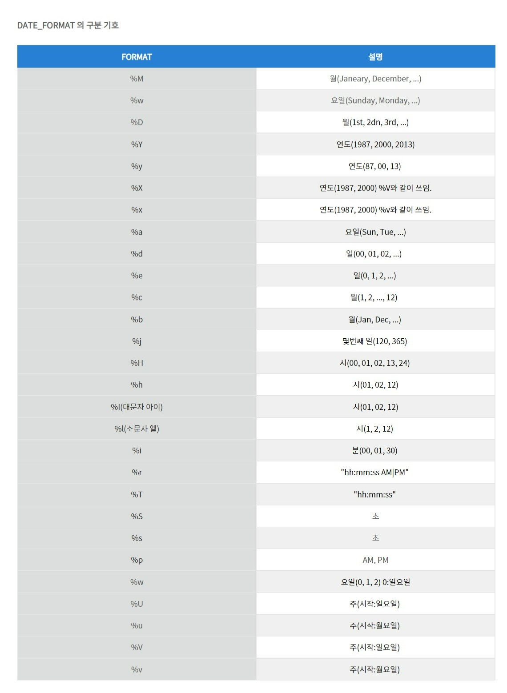

+++
author = "Hugo Authors"
title = "[SQL]MySQL"
date = "2021-08-14"
description = "MySQL 기초부터 프로그래머스 SQL 고득점 Kit까지"
categories = [
    "TIL"
]
tags = [
    "SQL", "MySQL", "프로그래머스"

]

image = "mysql.png"

+++

# MySQL👨‍💻

> MySQL은 가장 널리 사용되고 있는 관계형 데이터베이스 관리 시스템(RDBMS: Relational DBMS)이다!

## 1. SQL문 기초

* SHOW DATABASES : 서버에 있는 DB보여주기
* USE : 특정 DB 사용
* SHOW TABLE, SHOW TABLE STATUS : 해당 DB의 테이블 이름보기 / 정보 조회
* DESCRIBE (DESC) : 특정 테이블에 무슨 열이 있는지 확인
* SELECT : 원하는 결과 출력하기
* WHERE : 출력을 위한 조건
* BETWEEN : 조건이 특정값 사이에 있을 때
* IN : 안에 있는지 없는지
* LIKE : _ 한글자 % / 글자수 제한 X
* Sub Query : =로 연결한 서브쿼리
* ANY(SOME) : 하나라도 만족하면
* ALL : 모두 만족
* ORDER BY : 정렬 AES 오름차순 / DESC 내림차순
* DISTINCT : 중복제거
* LIMIT : 출력할 결과물 개수제한
* GROUP BY : 그룹으로 묶어서 집계함수와 함께 사용
* HAVING : 집계함수에 대한 조건
* ROLLUP : GROUP BY절에서 WITH ROLLUP으로 사용하며 총합 또는 중간합계
* JOIN : 여러 테이블을 합칠때 사용, ON을 통해 조건을 제시

## 2. MySQL 내장함수

* LENGTH() : 문자열 길이 반환
* CONCAT() : 전달받은 문자열을 모두 결합하여 하나의 문자열로 반환, 하나라도 NULL값이 있으면 NULL을 반환
* LOCATE() : 찾는 문자열이 처음으로 나타나는 위치를 찾아서 반환, 없으면 0을 반환하며, MySQL에서는 문자열의 시작 인덱스를 1로 계산
* LEFT(), RIGHT() : 문자열의 왼쪽 / 오른쪽에서 부터 지정한 개수만큼 문자 반환
* LOWER(), UPPER() : 소문자 / 대문자 변환하여 반환
* REPLACE() : 문자열에서 특정 문자열을 다른 문자열로 변환하여 반환
* TRIM() : 공백제거 / LEADING : 앞에 존재하면 제거 / TRAILING : 뒤에 존재하면 제거
* FORMAT() : 숫자타입의 데이터를 세자리마다 쉼표로 구분
* FLOOR(), CEIL(), ROUND() : 내림 / 올림 / 반올리
* SQRT(), POW(), EXP(), LOG() : 양의 제곱근 / 첫째 인수를 밑, 둘째 인수를 지수로 거듭제곱 / 자연상수의 거듭제곱 / 자연로그
* SIN(), COS(), TAN() : 사인 / 코사인 / 탄젠트
* ABS(), RAND() : 절대값 / 0~1사이의 하나의 실수를 무작위로 생성
* NOW(), CURDATE(), CURTIME() : 현재 날짜와 시간 / 현재 날짜 / 현재 시간
* DATE(), MONTH(), DAY(), HOUR(), MINUTE(), SECOND() : 전달받은 값에 대한 날짜 정보 / 월 정보 / 일 정보 / 시간 정보 / 분 정보 / 초 정보
* MONTHNAME(), DAYNAME() : 월에 해당하는 이름을 반환 / 요일에 해당하는 이름을 반환
* DAYOFWEEK(), DAYOFMONTH, DAYOFYEAR() : 일자가 해당 주에서 몇번째 날짜인지(일요일=1, 토요일=7) / 일자가 해당 월에서 몇번째 날짜인지(0~31) / 일자가 해당 연도에서 몇번째 날인지(1~366)
* DATE_FORMAT() : 전달받은 형식에 맞춰 날짜와 시간 정보를 문자열로 반환

## 3. SQL 고급

* CREATE TABLE AS SELECT : 테이블을 복사하여 생성
* CREATE DATABASE : DB 생성
* CREATE TABLE : 테이블 생성
* ALTER TABLE (ADD, MODIFY, DROP) : 테이블 컬럼 수정 작업 추가 / 타입 수정 / 삭제

### 1. INDEX

> 원하는 데이터를 빠르게 찾기 위해 사용

* CREATE INDEX, ADD INDEX : ON을 사용해 특정 테이블에 인덱스 생성 / 추가
* SHOW INDEX : 인덱스 정보 보기
* CREATE UNIQUE INDEX : 중복값을 허용하지 않는 인덱스 생성
* FULLTEXT INDEX : 일반 인덱스와 다르게 매우 빠르게 테이블의 모든 텍스트 컬럼을 검색
* INDEX 삭제 (ALTER) : 인덱스 삭제
* DROP INDEX : ON을 사용해 특정 테이블의 인덱스 삭제

### 2. VIEW

> DB에 존재하는 일종의 가상 테이블

* CREATE VIEW : AS를 이용해 해당 컬럼을 가지는 뷰 생성
* ALTER VIEW : 뷰 수정
* DROP VIEW : 뷰 삭제

### 3. 데이터 추가

* INSERT : INTO를 사용하여 데이터 추가
* INSERT INTO SELECT : 다른 테이블에 있는 데이터를 추가
* UPDATE : SET을 사용하여 데이터를 수정
* DELETE : 데이터 삭제, 테이블 용량 자체는 줄지 않는다
* TRUNCATE : 데이터 삭제, 복구 불가
* DROP TABLE : 테이블 삭제
* DROP DATABASE : DB 삭제

## 4. 문제 풀이

[프로그래머스 SQL 고득점 Kit 문제](https://programmers.co.kr/learn/challenges)

### 추가 내용

#### 1. SET변수 활용

`SET`을 이용하면 변수처럼 활용할 수 있다. 단, `SET` 이외의 명령문에서는 `=`가 비교연산자로 취급되므로 `SELECT`로 변수를 선언하고 값을 대입할 때는 `:=`를 사용해야 한다.

```mysql
-- 0~24시까지 시간별로 데이터를 카운트 할 때
-- 데이터에 없는 시간까지 출력하기 위해서 SET변수 활용
SET @HOUR = -1;
SELECT (@HOUR := @HOUR + 1) AS 'HOUR', (SELECT COUNT(*) FROM ANIMAL_OUTS WHERE HOUR(DATETIME) = @HOUR) AS 'COUNT' FROM ANIMAL_OUTS WHERE @HOUR < 23
```

#### 2. OUTER JOIN


#### 3. DATA_FORMAT

