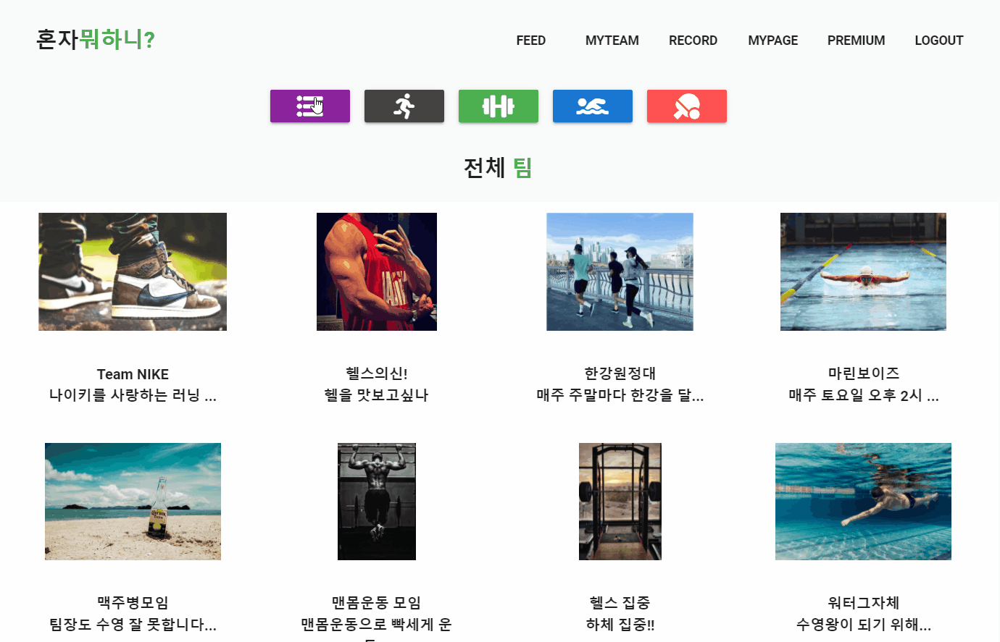
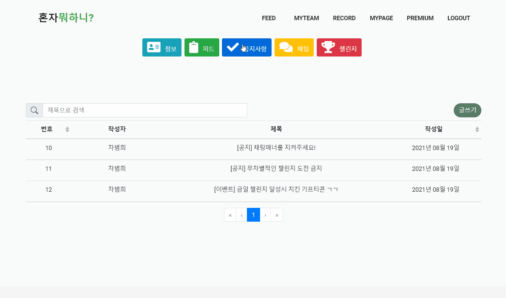

+++
author = "Hugo Authors"
title = "혼자뭐하니"
date = "2021-09-04"
description = "혼자 아닌 함께하는 운동생활, 혼자뭐하니"
categories = [
    "Toy-project"
]
tags = [
    "ssafy", "project", "sports"

]

image = "main.png"

+++

# 🏊‍♂️ 혼자 뭐하니?!

> `혼자뭐하니`는 SSAFY 공통프로젝트에서 진행했던 팀프로젝트로, 원하는 운동종목의 그룹을 찾아 함께 즐겁게 운동을 하는 SNS 서비스이다.

## 1. 프로젝트 소개

매번 새해가 밝으면 우리 모두 하는 다짐, 꾸준한 운동!!! 하지만 이를 이루어나가기는 쉽지 않습니다. 그래서 준비한 서비스 🎉**혼자뭐하니**🎉

혼자뭐하니는 사용자가 원하는 운동종목으로 팀을 찾거나 만들어서 팀원들과 함께 소통하며 운동을 하는 서비스입니다. 또한 그룹 챌린지와 공통 미션들을 통해 보다 즐겁고 꾸준하게 운동을 지속할 수 있으며 결재시스템과 추천시스템을 통해 차별화된 서비스를 제공합니다.

### 팀 목록 페이지

이미지를 클릭하면 움짤로 볼 수 있습니다 👇

### 그룹 페이지

역시 이미지를 클릭하면 움짤로 볼 수 있습니다 👇

## 2. 맡은 역할 & 후기

해당 프로젝트에서 `프론트엔드`를 맡아서 진행하였습니다.👨‍💻💦

다수의 인원들과 웹개발 협업 프로젝트를 진행하면서 제대로된 프론트엔드 개발을 경험할 수 있었고 협업 프로젝트 관리 서비스인 `JIRA`와 `Git`을 본격적으로 사용할 수 있었던 소중한 경험이었습니다. 다음 프로젝트는 때는 `백엔드`도 경험해 볼 수 있으면 좋겠다 생각했습니다.

또한 결과물이 최우수 작품으로 선정되어 보다 뿌듯함을 느낄 수 있었습니다!! 팀원들 쵝오!!😎

## 3. 관련 링크

* [깃허브](https://github.com/ssabum/Are-you-by-yourself "혼자뭐하니 깃허브")
* [노션](https://www.notion.so/WIKI-986c409e700b4d95837f7321ea11e080 "혼자뭐하니 개발 노션")

